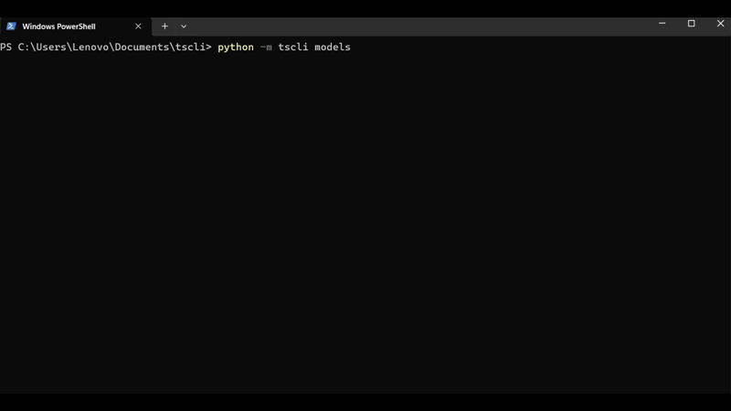

# tscli

`tscli` is a command-line tool for time series analysis and forecasting built around [DARTS](https://unit8co.github.io/darts/).

It is designed for a simple workflow:

- load a CSV
- clean common formatting issues
- inspect and analyze the series
- compare models on a holdout window
- generate and export forecasts



## What It Does

- works directly from CSV files
- detects and fixes common time-series formatting issues
- supports a clean `date + target` workflow
- benchmarks multiple models with `MAE`, `RMSE`, and `MAPE`
- exports cleaned datasets, forecasts, benchmark tables, and plots
- provides an interactive terminal mode

## Install

Main install:

```bash
pip install tscli-darts
```

Local development install:

```bash
pip install -e .
```

Optional extras:

- Classical DARTS models such as `theta` and `exponential-smoothing`

```bash
pip install -e .[classical]
```

- AutoARIMA support

```bash
pip install -e .[autoarima]
```

- Everything

```bash
pip install -e .[full]
```

## Typical Workflow

### 1. Inspect the raw CSV

Use this first to confirm the time column, target column, inferred frequency, and any preprocessing fixes.

```bash
python -m tscli inspect .\sales.csv --time-col Month --target-col Sales
```

### 2. Clean the dataset

If the CSV has shorthand dates, duplicate timestamps, formatted numeric values, or other simple issues, save a normalized version.

```bash
python -m tscli clean .\sales.csv --time-col Month --target-col Sales --output .\cleaned_sales.csv
```

### 3. Analyze the time series

Get quick descriptive statistics and recent observations before forecasting.

```bash
python -m tscli analyze .\cleaned_sales.csv --time-col Month --target-col Sales
```

### 4. Benchmark models

Run several models against a holdout window, compare metrics, and optionally export the score table, forecast, and plot.

```bash
python -m tscli benchmark .\cleaned_sales.csv --time-col Month --target-col Sales --horizon 12 --models all --scores-output .\scores.csv --forecast-output .\best_forecast.csv --plot-output .\benchmark.png
```

### 5. Generate a forecast

Forecast future periods with a chosen model and optionally export the forecast and chart.

```bash
python -m tscli forecast .\cleaned_sales.csv --time-col Month --target-col Sales --model naive-drift --horizon 12 --output .\forecast.csv --plot-output .\forecast.png
```

### 6. Use interactive mode

Run the full workflow from a menu-driven terminal interface.

```bash
python -m tscli interactive .\cleaned_sales.csv --time-col Month --target-col Sales
```

## Commands

- `inspect`: summarize the dataset and show preprocessing fixes
- `clean`: normalize and save a cleaned CSV
- `analyze`: print descriptive statistics and recent observations
- `forecast`: generate future values from one model
- `benchmark`: compare several models on a holdout window
- `models`: list supported forecasting models
- `interactive`: launch the terminal menu workflow

## Forecasting Models

Supported models:

- `naive-last`
- `naive-drift`
- `naive-seasonal`
- `moving-average`
- `weighted-moving-average`
- `exp-smoothing`
- `seasonal-average`
- `seasonal-median`
- `linear-trend`
- `quadratic-trend`
- `arima`
- `sarima`
- `theta`
- `exponential-smoothing`
- `auto-arima`

## Example Dataset

The bundled `examples/sales.csv` shows a shorthand monthly sales format like:

```csv
Month,Sales
1-01,266.0
1-02,145.9
1-03,183.1
```

`tscli` will detect and normalize that `Month` column into proper first-of-month datetimes.

## Notes

- The CSV should include a target column and optionally a time column.
- If no time column is provided, `tscli` builds a synthetic integer index.
- If DARTS cannot infer a frequency automatically, forecasting still uses the ordered observations.
- Some classical DARTS models depend on optional libraries; when unavailable, `forecast` explains the missing requirement and `benchmark` skips the model.
- `arima` and `sarima` remain DARTS-first models, with fallback behavior only when the DARTS classical path is unavailable.

## Packaging

To build distributable artifacts locally:

```bash
python -m pip install build
python -m build
```

This will generate source and wheel distributions in `dist/`.
